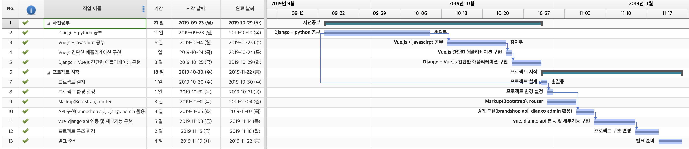

# :bulb: New Brand Shop Project :bulb:


## 주제

현재 브랜드관을 NEW 브랜드 샵으로 브랜드 마다 별도 운영하고 싶은 현업의 니즈가 있음.
Django & Vue.js를 통해 어느정도 빠르게 현업에 제공할 수 있는지 프로토타입 구현을 통해 파악.

```
newbrandshop(project)
├── client(vue)
│   ├── public
│   └── src
└── server(django)
    ├── config
    ├── item(app)
    ├── magazine(app)
    ├── styleshare(app)
    └── user(app)
```

- 프로젝트 기간 : 2019.09.23 ~ 2019.11.22



## :building_construction: Installation

### Server


```
$ pip install -r server/requirements/development.txt
$ pip install -r server/requirements/production.txt
```

`pip` 를 이용해서 필요한 라이브러리를 설치할 것이다. 이때 pip가 설치되어 있지 않다면, 아래 링크를 참조해 환경 설정이 필요하다.

[:runner: Install pip package manager and virtualenv package](./documents/setup-django.md)

### Client

🚨 node.js 패키지가 설치되어 있어야한다. ([🏃 Install package of node.js](./documents/setup-vuejs.md))

프로젝트를 실행하기 전에, npm을 이용해 필요한 패키지를 설치해야한다.

```bash
new-brand-shop/client $ npm install vue
```

## :floppy_disk:Database

자세한 설명은 하단에 추가했습니다.

#### Migrate

프로젝트에 생성되어 있는 모델을 Migration 해준다.

```bash
new-brand-shop $ cd server
```

```bash
new-brand-shop/server $ python ./manage.py makemigrations
```

```bash
new-brand-shop/server $ python ./manage.py migrate
```


### Insert Data

마이그레이션 후에는 기존에 생성해둔 데이터를 모델에 추가해준다. (로컬 테스트용)

```bash
new-brand-shop/server $ python ./manage.py loaddata user/fixtures/data.json
new-brand-shop/server $ python ./manage.py loaddata item/fixtures/data.json
new-brand-shop/server $ python ./manage.py loaddata styleshare/fixtures/data.json
new-brand-shop/server $ python ./manage.py loaddata magazine/fixtures/data.json
```


## :rocket: Launch

준비가 다 되었다면, 각각 서버를 실행시켜준다.

### Server

```bash
$ cd server
$ python manage.py runserver
```

### Client

```bash
$ cd client
$ npm update
$ npm run serve
```

## 접속하기

### Admin

[http://local-display.cjmall.com:8000/admin/](http://local-display.cjmall.com:8000/admin/)로 장고 어드민 페이지에 접속할 수 있다.

- id : admin@example.com
- password :admin

### 서비스 페이지

[http://local-display.cjmall.com:8000/](http://local-display.cjmall.com:8000/)

현재 styleshare에서 내 스타일 공유하기 부분은 어드민 페이지 로그인한 후에 등록할 수 있다.

## Debug

Debug가 하고싶은 코드 부분에 pdb.set_trace()를 입력해 디버깅 할 수 있다.

```python
import pdb; pdb.set_trace()
```

## Create App

추가적으로 app을 만들고 싶은 경우에는 `startapp` 명령어로 생성할 수 있다.

```bash
$ django-admin startapp <app_name>
```

- `config/settings/base.py`  파일에 `INSTALLED_APPS` 부분에 새로 생성한 App Config를 추가해준다.

```python

INSTALLED_APPS = [
 	...
    # project apps
    'magazine.apps.MagazineConfig',
    'styleshare.apps.StyleshareConfig',
    'item.apps.ItemConfig',
    'user.apps.UserConfig',
    # your app config
]
```

## :floppy_disk:Database

### create table

테이블은 각 앱 내부의 `models.py` 파일에서 생성/수정할 수 있다.

```python
# app/models.py
from django.db import models
class ModelName(models.Model):
	title = models.CharField("제목", max_length=100)
	content = models.TextField("내용")
	created_at = models.DateTimeField("등록일", auto_now_add=True)
	# fieldname = models.FieldType("comment", **validate)
```

#### migrate

```bash
$ python ./manage.py makemigrations
```

`makemigrations` 로 database migrate를 할 수 있으며, 만약 해당 SQL문을 보고 싶은 경우에는 `sqlmigrate` 명령어로 확인할 수 있다.

```bash
$ python ./manage.py sqlmigrate <app_name> <migration_number>
$ python ./manage.py sqlmigrate item 0001
```

```sql
BEGIN;
--
-- Create model Post
--
CREATE TABLE "appname_modelname" ("id" integer NOT NULL PRIMARY KEY AUTOINCREMENT, "title" varchar(100) NOT NULL, "content" text NOT NULL, "created_at" datetime NOT NULL);
COMMIT;
```

`makemigrations` 후에는 `migrate` 명령어로 확정지어줘야한다.

```bash
$ python ./manage.py migrate
```
### SQL query

`Manager.raw()` 를 이용해서 ORM이 아닌 SQL문을 그대로 사용할 수 있다. ([Performing raw SQL queries](https://docs.djangoproject.com/en/2.2/topics/db/sql/))

```python
first_person = Person.objects.raw('SELECT * FROM myapp_person')[0]
```

```python
def ModelManager(models.Manager):
	def with_counts(self):
	     from django.db import connection
	     with connection.cursor() as cursor:
	         cursor.execute("""
	             SELECT p.id, p.question, p.poll_date, COUNT(*)
	             FROM polls_opinionpoll p, polls_response r
	             WHERE p.id = r.poll_id
	             GROUP BY p.id, p.question, p.poll_date
	             ORDER BY p.poll_date DESC""")
	         result_list = []
	         for row in cursor.fetchall():
	             p = self.model(id=row[0], question=row[1], poll_date=row[2])
	             p.num_responses = row[3]
	             result_list.append(p)
	     return result_list
```
Django ORM의 Queryset에 해당하는 SQL 쿼리를 보려면 각 QuerySet 객체는 디버깅을 위해 stdout에 로그나 출력할 수 있는 속성을 가지고 있다.

```python
qs = Model.objects.filter(name='test')
print(qs.query)
```

만약에 자동으로 앱에 데이터를 생성하고 싶은 경우에는 `manage.py loaddata <fixtures>` 를 사용하면된다.

```bash
$ python ./manage.py loaddata user/fixtures/data.json
$ python ./manage.py loaddata item/fixtures/data.json
$ python ./manage.py loaddata styleshare/fixtures/data.json
$ python ./manage.py loaddata magazie/fixtures/data.json
```

또한, 데이터와 테이블을 다음 명령어로 삭제할 수 있다.

```bash
$ find . -path "*/migrations/*.py" -not -name "__init__.py" -delete
$ find . -path "*/migrations/*.pyc" -delete
$ rm -rf config/db.sqlite3
```

#### dumpdata

dumpdata는 해당 앱에 있는 데이터를 json 파일로 생성하는 방법이다.

```bash
$ python manage.py dumpdata <app_name>.<model> --indenet 4  > file.json
```
```bash
$ ./manage.py dumpdata user.User --indent 4 > user/fixtures/data.json
$ ./manage.py dumpdata item.Item --indent 4 > item/fixtures/data.json
$ ./manage.py dumpdata magazine.Magazine --indent 4 > magazine/fixtures/data.json
$ ./manage.py dumpdata styleshare.StyleShare --indent 4 > styleshare/fixtures/data.json
```

## Django Admin

- [http://demo.jet.geex-arts.com/admin/](http://demo.jet.geex-arts.com/admin/)

## 관련 내용 정리 문서

- [Vue.js](https://dh00023.gitbooks.io/vue-js/content/)
- [Django](https://dh00023.gitbooks.io/django/content/)